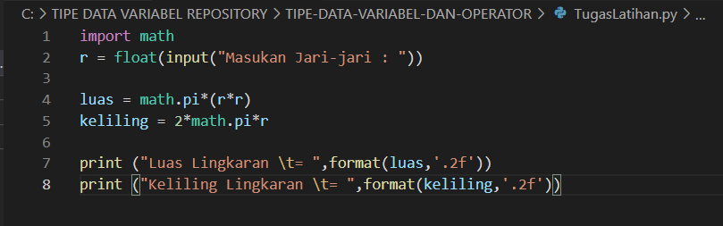

# TIPE-DATA-VARIABEL-DAN-OPERATOR

## Tugas Latihan

## Rumus Luas & Keliling Lingkaran

    Nilai Phi yang akan kita gunakan adalah 3.14
    r merupakan jari-jari lingkaran

Phi merupakan nilai konstanta di matematika sementara jari-jari merupakan jarak antara titik pusat dengan tepi lingkaran. Sebetulnya ada rumus lain untuk menghitung keliling lingkaran yaitu dengan menggunakan diameter, tapi pada kasus ini kita cukup menggunakan jari jari lingkaran saja.

## Flowchart Menghitung Luas & Keliling Lingkaran

## Program Python Menghitung Luas & Keliling Lingkaran

## Output

## Penjelasan

untuk mengambil 2 angka pecahan saja kita pakai fungsi format() seperti berikut:

Dengan penggunaan fungsi format(luas,’.2f’) akan menghasilkan 2 angka pecahan saja.